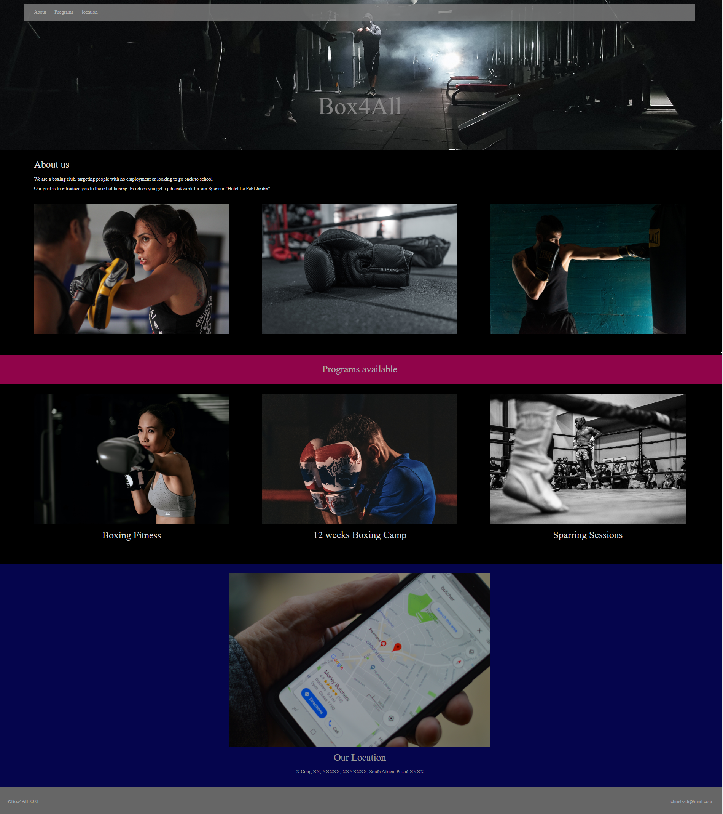

# Codecademy Challenge Project: Responsive Club Website

In this project, I built my own club group page that will dynamically respond as you adjust the size of your screen!​​

## Table of Contents

- [General Info](#general-information)
- [Technologies Used](#technologies-used)
- [Screenshots](#screenshots)
- [Setup](#setup)
- [Project Status](#project-status)
- [Acknowledgements](#acknowledgements)
- [Contact](#contact)
<!-- * [License](#license) -->

## General Information

- This is a Codecademy project written in basic HTML 5 and CSS syntaxes. This is a simple website for a boxing club.
- This project is part of the "Full-Stack Engineer" course on codecademy.
<!-- You don't have to answer all the questions - just the ones relevant to your project. -->

## Technologies Used

- VSCode - version 1.60.2
- Google Chrome (browser)

## Screenshots

## Setup

You need to have the following installed on your computer:

- VSCode
- Google Chrome or Edge

The code is written in basic HTML and CSS syntaxes. You will find the files on this repository.

To open the file on your browser, you need to download the folder containing the project and open the index file with the extension HTML on your browser, it should look like the screenshot.

## Project Status

I may revisit and add more to this project once i have finished my course.

## Acknowledgements

- This project was based on <https://www.codecademy.com/paths/full-stack-engineer-career-path/tracks/fscp-making-a-website-responsive/modules/fecp-challenge-project-responsive-club-website/projects/responsive-club-website>.

- Many thanks to codecademy for this exposure.

## Contact

Created by [@Christ Sadi) - feel free to contact me!
